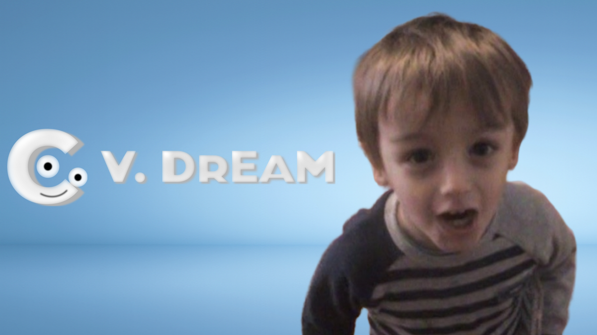
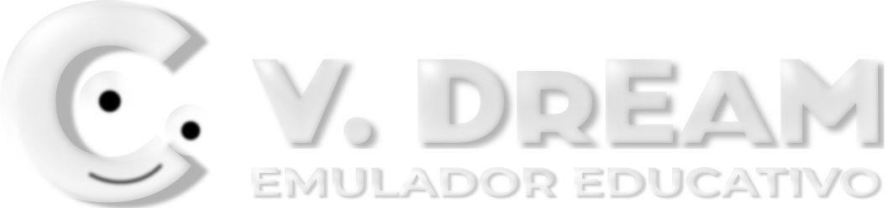

# V.Dream
 
**ENGLISH: **
 
V.Dream is a V.Smile emulator developed by Néo Foderé de Frutos under the FODSOFT™ brand and written in C, C# and XAML for modern devices. With V.Dream, you can play and relive the games from your childhood or discover them for the first time, develop your own software with instructions for the emulated hardware, among other features. It should be noted that neither FODSOFT™ nor V.Dream provide ROMs or any other means that facilitate piracy; the only thing FODSOFT™ offers is software that simulates the hardware of that era so the games can run on modern devices. 
**ESPAÑOL: **
 
V.Dream es un emulador de la V.Smile desarrollado por Néo Foderé de Frutos bajo la marca FODSOFT™ y escrito en C, C# y XAML para dispositivos modernos. Con V.Dream podrás jugar y recordar los juegos de tu infancia o descubrirlos por primera vez, desarrollar tu propio software con instrucciones para el hardware emulado, entre otras funciones. Cabe aclarar que ni FODSOFT™ ni V.Dream ofrecen ROMs o otro tipo de medio que facilite la piratería, lo único que ofrece FODSOFT™ es un software que simula ser el hardware de aquella época para que los juegos puedan ejecutarse en dispositivos modernos. 
**FRANÇAIS: **
 
V.Dream est un émulateur de la V.Smile développé par Néo Foderé de Frutos sous la marque FODSOFT™ et écrit en C, C# et XAML pour appareils modernes. Avec V.Dream, vous pourrez rejouer et vous remémorer les jeux de votre enfance ou les découvrir pour la première fois, développer votre propre logiciel avec des instructions pour le matériel émulé, parmi d’autres fonctions. Il convient de préciser que ni FODSOFT™ ni V.Dream n’offrent de ROMs ni aucun autre support facilitant le piratage ; la seule chose que propose FODSOFT™ est un logiciel qui simule le matériel de l’époque afin que les jeux puissent s’exécuter sur des appareils modernes. 

**V.Dream is an independent project of FODSOFT™ and is not affiliated with, endorsed by, or in any way connected to VTech® or any of its subsidiaries or affiliates. This software is created solely as a tribute to a classic educational console experience and is intended for preservation and educational purposes.  
V.DREAM DOES NOT ACCEPT DONATIONS.  
© 2025 FODSOFT™. Néo Foderé de Frutos. All rights reserved.**
