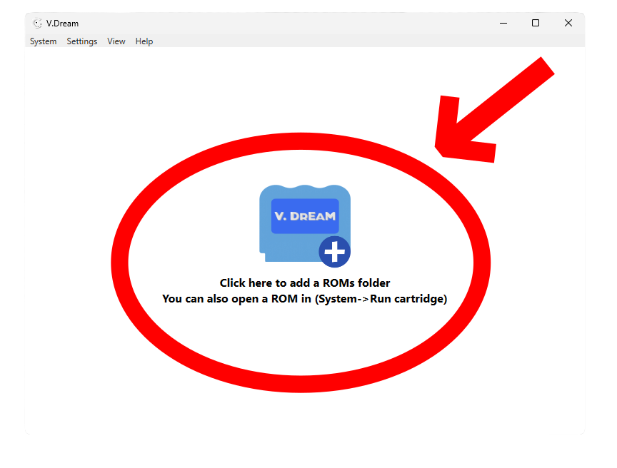
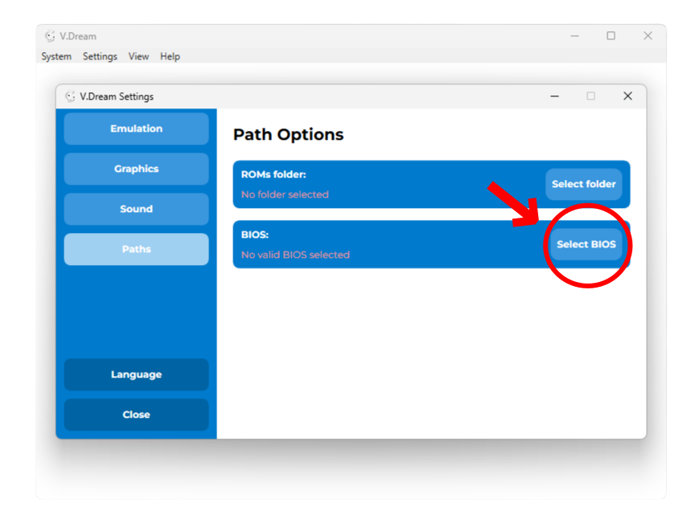
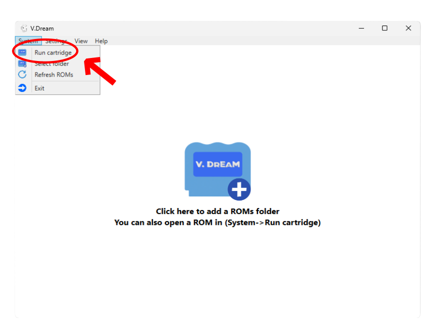
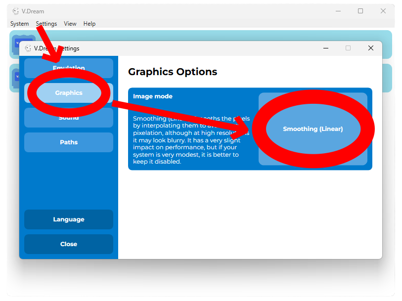
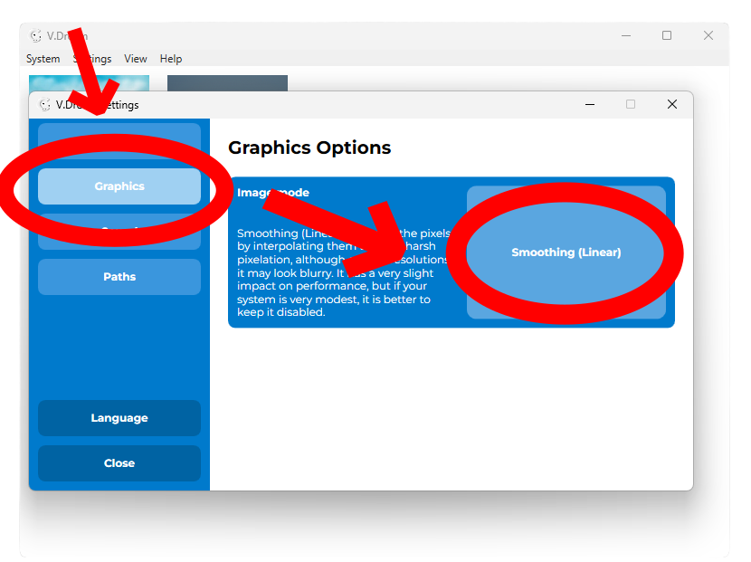
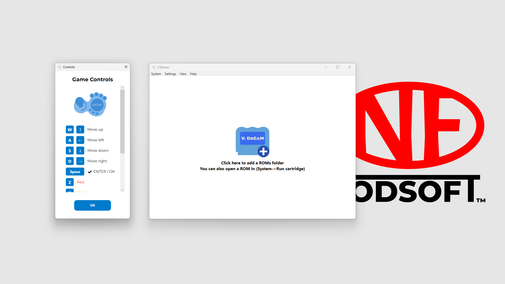
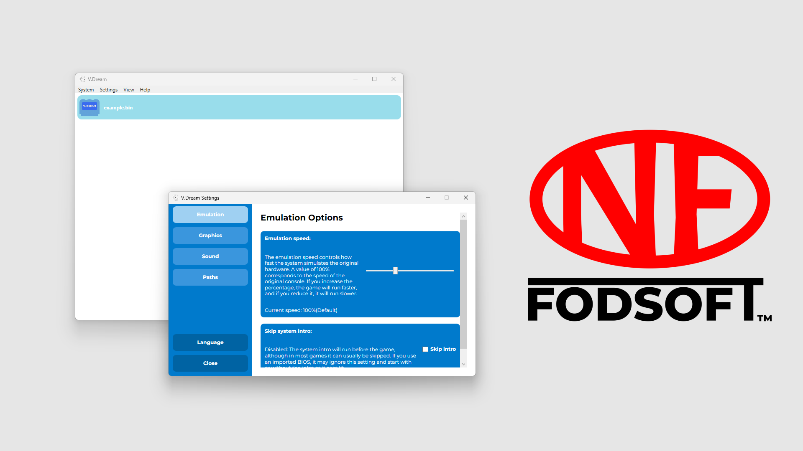
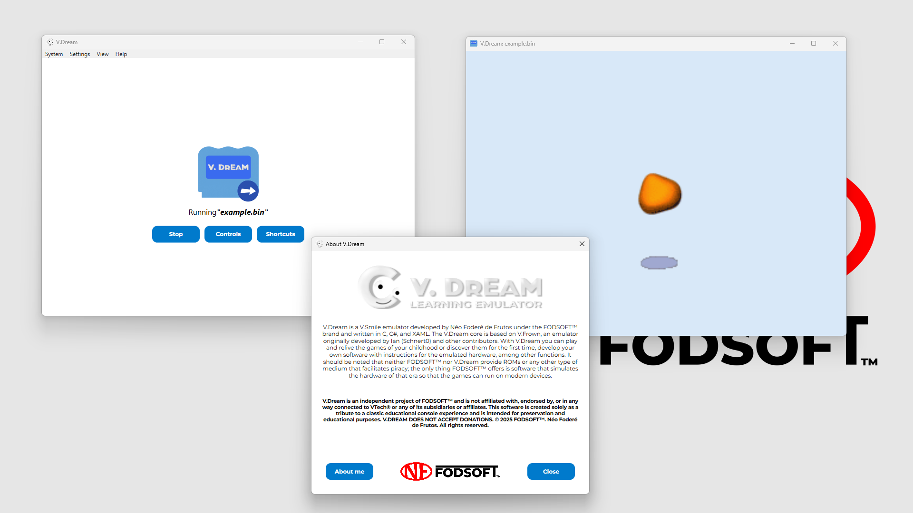
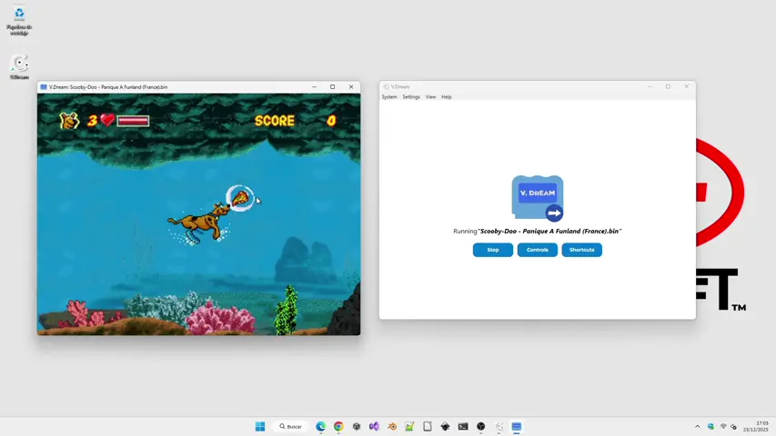

# V.Dream

## 📖 Description

>[!NOTE]
>V.Dream is a long-term project, and it will keep evolving over time. In the future, it aims to emulate the entire V.Smile family.

V.Dream is a V.Smile emulator developed by **Néo Foderé de Frutos** under the **FODSOFT™** brand and written in `C`, `C#`, and `XAML`. The V.Dream's V.Smile core is based on V.Frown, an emulator originally developed by **Ian (Schnert0)** and other contributors.

With V.Dream, you can play and relive the games from your childhood or discover them for the first time, develop your own software with instructions for the emulated hardware, among other features. It should be noted that neither FODSOFT™ nor V.Dream provide ROMs or any other means that facilitate piracy; the only thing FODSOFT™ offers is software that simulates the hardware of that era so the games can run on modern devices.

## 💾 Downloads
### 🌐 `from resources.fodsoft.com`
[Download the installer](https://resources.fodsoft.com/downloads/vdream-win-installer)

[Download the portable version (x64)](https://resources.fodsoft.com/downloads/vdream-win-x64-portable)

[Download the portable version (x86)](https://resources.fodsoft.com/downloads/vdream-win-x86-portable)

### 🧭 `Other download options`
[Download from Uptodown](https://v-dream.en.uptodown.com/windows)

[Download from Softpedia] (https://www.softpedia.com/get/System/Virtualization-Emulation/V-Dream.shtml)

[Download from Itch](https://fodsoft.itch.io/vdream)

[Download from SourceForge](https://sourceforge.net/projects/v-dream/files/)

## 🔧 Installation and Setup guide
> [!IMPORTANT]
>🧩 ***First, download and install the .NET Desktop Runtime 8.0 or later from the Microsoft website if you don’t already have it.***

1. Download and install the **vdream_installer.exe** file.

- 1.1. Run it and select an installation folder, or use the default one. **(If you select a folder that requires elevated write permissions, you will need to run V.Dream as an administrator whenever you want to use it)**.

2. Or download and extract the **vdream_portable_{architecture}.7z** file and run **vdream.exe**.

3. Open V.Dream and press the center button to select a folder, or go to `System -> Select folder`.  

4. Or go to `System -> Run cartridge` to launch a game directly.  

>[!TIP]
>If V.Dream does not recognize a ROM as valid and you are sure it is valid and not corrupted, try signing the ROM with my script `scripts/INSERT_SIGN.PS1`. This script inserts the VTech signature into an empty space in the ROM so that the emulator can detect it. To use the script, follow the instructions in the README file inside the `scripts/` folder in the project's GitHub.

5. Now you can play, but some games require an official BIOS file. To import it, go to `Settings -> Paths -> BIOS -> Select BIOS`, or try to launch a game that requires a BIOS file and press `Import BIOS`.  

6. If you want a smoother output image, change the setting from `Settings -> Graphics -> Image mode -> Smoothing (Linear)`.  

7. You can switch the game menu mode between a vertical list view and a customizable cover view from `View -> Covers` and `View -> List`.  

## 🕹️ Game Controls
| Keyboard             | V.Smile          |
|----------------------|------------------|
| [W], [↑]             | ⬆️ Move up       |
| [A], [←]             | ⬅️ Move left     |
| [S], [↓]             | ⬇️ Move down     |
| [D], [→]             | ➡️ Move right    |
| [Space]              | ✔️ ENTER / OK    |
| [Z]                  | 🔴 Red           |
| [X]                  | 🟡 Yellow        |
| [C]                  | 🔵 Blue          |
| [V]                  | 🟢 Green         |
| [E]                  | ❔ Help          |
| [Q]                  | ❌ Exit          |
| [Enter]              | 🔤 ABC           |

## ⌨️ Emulation shortcuts
| Keyboard             | Action           |
|----------------------|------------------|
| [F]                  | Full screen      |
| [Esc]                | Stop emulation   |
| [P]                  | Pause / Resume   |
| [R]                  | Restart          |
| [,]                  | Save state       |
| [.]                  | Load state       |

## 📸 Screenshots

## 🖼️ Gameplay GIFs

## 📁 V.Dream folder structure
`\saves`: Folder with your game savestates.

`\covers`: Folder with your game covers.

`vdream.exe`: The main executable of the emulator.

`vdream_core.exe`: The emulation core executable based on V.Frown.

`bios.bin`: A copy of the BIOS file you have imported.

`vdream.config`: Configuration file for user preferences.

`vdream_core.config`: Configuration file for internal emulation parameters.

### 📦 Files created by the installer
`V.Dream.lnk`: The V.Dream shortcut that points to **vdream.exe**.

`unins000.exe`: The V.Dream uninstaller.

`unins000.dat`: Data file used by the uninstaller to track installed files.

## 🌍 Supported languages
- 🇺🇸 English - ✅ 100% (Completed)

- 🇪🇸 Spanish - ✅ 100% (Completed)

- 🇫🇷 French - ✅ 100% (Completed)

## 📒 Planned features

>[!NOTE]
>I can't promise 100% that I'll be able to deliver everything, but my priority for the project is to add the following features:

- 🔊 Improved audio

- 💿 Compatibility with V.Flash / V.Smile Pro

- 👶 Compatibility with V.Smile Baby

- 🐧 Linux port

- 🤖 Android port

- ⚙️ More configurable settings

**V.Dream is an independent project of FODSOFT™ and is not affiliated with, endorsed by, or in any way connected to VTech® or any of its subsidiaries or affiliates. This software is created solely as a tribute to a classic educational console experience and is intended for preservation and educational purposes.**

**V.Smile® and all related trademarks are property of VTech®.**

***V.DREAM DOES NOT ACCEPT DONATIONS.***

**© 2026 FODSOFT™. Néo Foderé de Frutos. All rights reserved.**

<!-- FODSOFT(TM). Neo Fodere de Frutos. All rights reserved. -->
